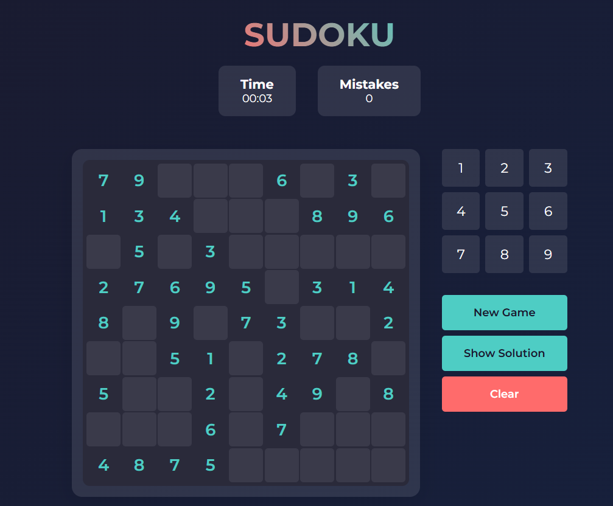
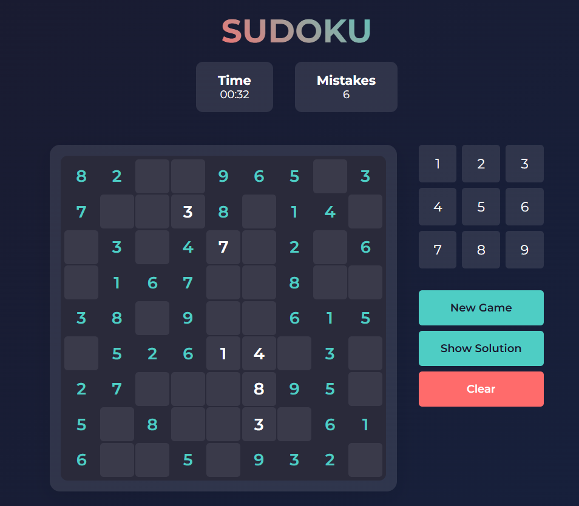
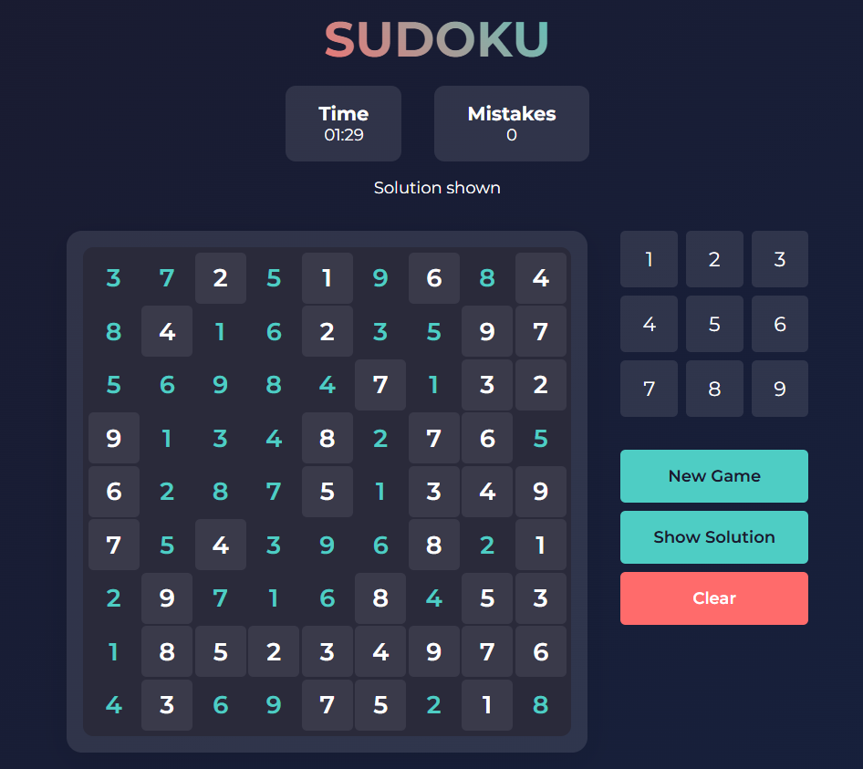

# Sudoku Solver

A web-based Sudoku Solver application that allows users to generate, solve, and clear Sudoku puzzles. Implementing Recursion and Backtracking search algorithms to efficiently solve Sudoku puzzles. 
This project is built with HTML, CSS, and JavaScript.

## Features

- **New Game:** Generates a new random Sudoku puzzle.
- **Show Solution:** Solves the currently loaded Sudoku puzzle.
- **Clear:** Clears the Sudoku board.

## Screenshots

  
  
  

